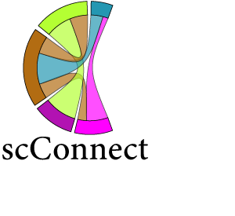

.. image:: https://readthedocs.org/projects/scconnect/badge/?version=latest
    :target: https://scconnect.readthedocs.io/en/latest/?badge=latest
    :alt: Documentation Status
 
.. image:: https://travis-ci.com/JonETJakobsson/scConnect.svg?branch=master
    :target: https://travis-ci.com/JonETJakobsson/scConnect
    
.. image:: https://badge.fury.io/py/scConnect.svg
    :target: https://badge.fury.io/py/scConnect

 
scConnect integrate gene expression profiles in scRNA-seq datasets with ligand and receptor interaction information from `Guide to pharmacology <https://www.guidetopharmacology.org/>`__ to construct a graph containing all putative interaction between cell types in the dataset. scConnect integrate well with Scanpy and  can be appended to  any scanpy analysis pipeline.

=========
Usecases:
=========

* Identify putative cell-cell communication in a tissue
* Infer neuronal networks based on ligand receptor compatability
* Study connectivity changes following treatment

??????????????????????????
Documentation and tutorial
??????????????????????????
For a short introduction to how scConnect can be used please check out this `tutorial`_ and for information about the API please consult the `documentation`_.

The quickest and easiest way to try out the tutorial is to run through this binder:

.. image:: https://mybinder.org/badge_logo.svg
 :target: https://mybinder.org/v2/gh/JonETJakobsson/scConnect/master?filepath=tutorial%2FConnecting%20brain%20regions.ipynb   
 
.. _tutorial: https://github.com/JonETJakobsson/scConnect/blob/master/tutorial/Connecting%20brain%20regions.ipynb
.. _documentation: https://scconnect.readthedocs.io/en/latest/

 **Note:** To run the web application in the tutorial, you will have to install scConnect and run on your local machine.

????????????
Installation
????????????

To install the latest stable version install using PYPI

.. code-block:: bash

    pip install scConnect
    
This will install all dependencies needed to run the tutorial, and utilize all features of scConnect.

To install the master branch, please clone this repository and install using

.. code-block:: bash

  cd scConnect/
  pip install .
  
  
or
 
.. code-block:: bash
 
   pip install git+https://github.com/JonETJakobsson/scConnect
    

  

